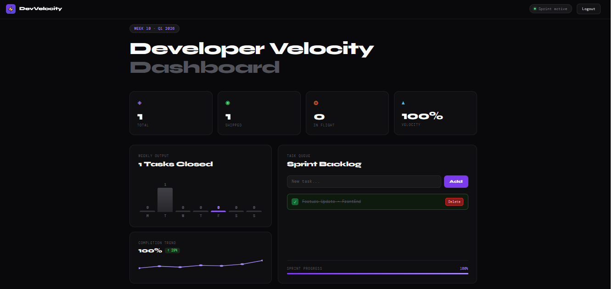
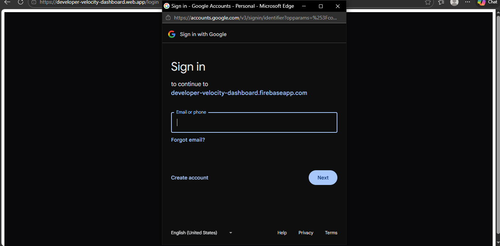

# 🚀 Developer Velocity Dashboard

A modern, real-time productivity dashboard for developers to track tasks, visualize completion trends, and monitor development velocity.

## 🌟 Live Demo

**🔗 [https://developer-velocity-dashboard.web.app](https://developer-velocity-dashboard.web.app)**

## 📸 Screenshots

### Dashboard Overview

*Main dashboard showing personalized task analytics and weekly output*

### Authentication

*Clean authentication with Google Sign-In and email/password options*

## ✨ Features

### 🔐 **Authentication**
- **Google Sign-In** - One-click authentication
- **Email/Password** - Traditional registration with validation
- **User Profiles** - Stored in Firestore with creation/login tracking
- **Password Requirements** - Minimum 8 characters with validation
- **Error Handling** - Comprehensive feedback for auth failures

### 📊 **Dashboard Analytics**
- **Real-time Stats** - Total, completed, and pending task counts
- **Weekly Output Chart** - Dynamic bar chart based on actual completions
- **Completion Trend** - Sparkline showing productivity patterns
- **Progress Tracking** - Visual progress bars and percentages

### ✅ **Task Management**
- **Add Tasks** - Quick task creation with enter key support
- **Complete Tasks** - One-click task completion
- **User-specific Data** - Each user sees only their tasks
- **Real-time Updates** - Instant UI updates on task changes

### 🎨 **Modern UI/UX**
- **Dark Theme** - Professional dark mode design
- **Responsive Design** - Works on desktop, tablet, and mobile
- **Smooth Animations** - Polished interactions and transitions
- **Custom Typography** - Syne and DM Mono font combination

## 🛠️ Tech Stack

### **Frontend**
- **Angular 20** - Latest Angular framework
- **TypeScript** - Type-safe development
- **Angular Signals** - Reactive state management
- **CSS3** - Custom styling with CSS variables

### **Backend & Database**
- **Firebase Auth** - User authentication
- **Firestore** - NoSQL database for tasks and user profiles
- **Firebase Hosting** - Static site hosting

### **Development Tools**
- **Angular CLI** - Project scaffolding and build tools
- **Firebase CLI** - Deployment and project management

## 🚀 Getting Started

### Prerequisites
- Node.js 18+ 
- Angular CLI 20+
- Firebase CLI

### Installation

1. **Clone the repository**
   ```bash
   git clone https://github.com/RahulRoy22/developer-velocity-dashboard.git
   cd developer-velocity-dashboard
   ```

2. **Install dependencies**
   ```bash
   npm install
   ```

3. **Configure Firebase**
   - Create a Firebase project at [Firebase Console](https://console.firebase.google.com)
   - Enable Authentication (Google + Email/Password)
   - Enable Firestore Database
   - Update `src/environments/environment.ts` with your Firebase config

4. **Run development server**
   ```bash
   ng serve
   ```
   Navigate to `http://localhost:4200/`

### Firebase Setup

1. **Authentication Setup**
   ```bash
   # Enable Google Sign-In in Firebase Console
   # Authentication → Sign-in method → Google → Enable
   ```

2. **Firestore Rules**
   ```javascript
   rules_version = '2';
   service cloud.firestore {
     match /databases/{database}/documents {
       match /users/{userId} {
         allow read, write: if request.auth != null && request.auth.uid == userId;
       }
       match /tasks/{taskId} {
         allow read, write: if request.auth != null && request.auth.uid == resource.data.userId;
       }
     }
   }
   ```

## 📦 Deployment

### Build for Production
```bash
ng build --configuration production
```

### Deploy to Firebase
```bash
firebase deploy
```

## 🏗️ Project Structure

```
src/
├── app/
│   ├── components/
│   │   ├── dashboard/          # Main dashboard component
│   │   └── login/              # Authentication component
│   ├── services/
│   │   ├── auth.service.ts     # Authentication logic
│   │   └── task.service.ts     # Task management logic
│   ├── models/
│   │   └── task.model.ts       # Task interface
│   └── environments/           # Environment configurations
├── styles.css                  # Global styles
└── index.html                  # Main HTML file
```

## 🔧 Configuration

### Environment Variables
Update `src/environments/environment.ts`:
```typescript
export const environment = {
  production: true,
  firebase: {
    apiKey: "your-api-key",
    authDomain: "your-project.firebaseapp.com",
    projectId: "your-project-id",
    // ... other Firebase config
  }
};
```

## 🧪 Testing

### Run Unit Tests
```bash
ng test
```

### Run E2E Tests
```bash
ng e2e
```

## 📈 Features in Detail

### Dynamic Analytics
- **Weekly Output**: Real-time chart showing task completions by day
- **Completion Rate**: Percentage of completed vs total tasks
- **Trend Analysis**: Sparkline visualization of productivity patterns

### User Experience
- **Instant Feedback**: Real-time updates without page refresh
- **Error Handling**: User-friendly error messages
- **Loading States**: Visual feedback during operations
- **Responsive Design**: Optimized for all screen sizes

## 🤝 Contributing

1. Fork the repository
2. Create a feature branch (`git checkout -b feature/amazing-feature`)
3. Commit changes (`git commit -m 'Add amazing feature'`)
4. Push to branch (`git push origin feature/amazing-feature`)
5. Open a Pull Request

## 📄 License

This project is licensed under the MIT License - see the [LICENSE](LICENSE) file for details.

## 🙏 Acknowledgments

- Angular team for the amazing framework
- Firebase for backend services
- Google Fonts for typography
- Community for inspiration and feedback

## 📞 Contact

**Rahul Roy** - [GitHub](https://github.com/RahulRoy22)

**Project Link**: [https://github.com/RahulRoy22/developer-velocity-dashboard](https://github.com/RahulRoy22/developer-velocity-dashboard)

---

⭐ **Star this repository if you found it helpful!**